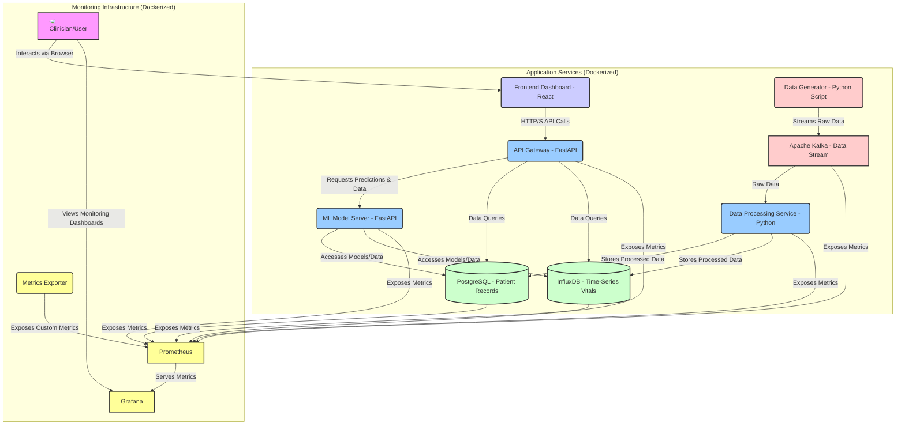
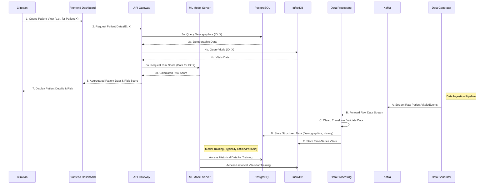
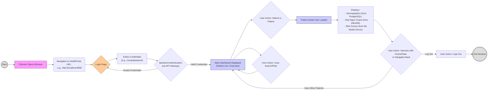

# HealthPulse Analytics: Workflow and Data Flow Diagrams

This document provides visual diagrams to illustrate the architecture, data flow, and user interaction patterns within the HealthPulse Analytics platform. These diagrams are rendered using Mermaid.js.

## 1. High-Level System Architecture

This diagram shows the major components of HealthPulse Analytics and how they connect. It provides an overview of the microservices, data stores, and monitoring infrastructure.

## 2. Data Flow for Patient Risk Prediction

This sequence diagram illustrates the journey of patient data from its source (or simulation) through processing and analysis, ultimately resulting in risk predictions displayed on the clinician's dashboard.

## 3. User Interaction Flow (Clinician with Dashboard)

This flowchart outlines a typical interaction sequence for a clinician using the HealthPulse dashboard, from login to viewing patient details.

These diagrams provide a simplified visual representation of the HealthPulse Analytics system. For more detailed architectural information, please refer to the main [README.md](../README.md) and other documents in the `/docs` folder.
